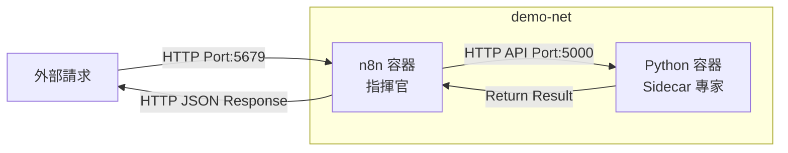

# Docker 微服務編排示範專案

本專案展示如何透過 Docker Compose 建立一個具備 **Sidecar 架構** 的自動化環境，由 **n8n** 進行工作流編排，並調用 **Python 爬蟲服務** 執行數據處理任務。

## 架構說明

- **n8n (指揮官)**：負責流程編排、接收外部 Webhook 觸發，並透過內部網路調用 Sidecar。
- **Python Sidecar (專業 Worker)**：運行 Flask 服務，內建 `requests` 與 `BeautifulSoup`，負責執行實際的網頁抓取邏輯。
- **內部通訊**：使用 Docker 網路 `demo-net`，n8n 可透過 `http://sidecar:5000` 直接存取 Python 服務。



## 目錄結構

```text
docker-demo/
├── docker-compose.yml       # 容器服務定義
├── scraper_workflow_sync.json # n8n 匯入用的工作流定義
└── sidecar/
    ├── Dockerfile           # Python 執行環境建置檔
    ├── app.py               # Flask API 服務程式碼
    └── routes/              # 功能模組路由
```

## 快速啟動

1. **啟動服務**：
   ```bash
   docker compose up -d --build
   ```
2. **服務存取**：
   - n8n (指揮官): `http://localhost:5679`
   - Python Sidecar API (專家): `http://localhost:5000`

## 測試驗證方式

### 1. 直連 Sidecar API 測試 (開發調試)
直接測試 Python 容器邏輯，無需經過 n8n。使用 Port **5000**。

* **爬蟲測試**:
  ```bash
  curl -s "http://localhost:5000/api/scraper/scrape?url=https://dashboard.ngrok.com"
  ```
* **字數分析測試**:
  ```bash
  curl -X POST -H "Content-Type: application/json" -d '{"text": "Hello world"}' "http://localhost:5000/api/analyzer/analyze"
  ```

### 2. n8n 工作流測試 (自動化編排)
透過 n8n 接收 Webhook 並自動觸發後端服務。使用 Port **5679**。

* **爬蟲工作流**:
  ```bash
  curl -s "http://localhost:5679/webhook/scrape-trigger?url=https://dashboard.ngrok.com"
  ```
* **字數分析工作流**:
  ```bash
  curl -X POST -H "Content-Type: application/json" -d '{"text": "Hello world"}' "http://localhost:5679/webhook/analyze-trigger"
  ```

## 功能模組與路由分流
- 透過 Flask Blueprints 將應用程式模組化 (Sidecar/routes/)，實現路由分流：
  - `/api/scraper/scrape`: 執行網頁爬蟲任務。
  - `/api/analyzer/analyze`: 執行文字數據統計任務。
- 新增 `analyzer_workflow.json` 以支援字數統計工作流的同步呼叫。

### 如何新增功能模組
若要新增更多 API 功能，請遵循以下步驟：
1. 在 `sidecar/routes/` 目錄下建立新的路由檔案 (例如 `new_module.py`)。
2. 使用 Flask `Blueprint` 定義邏輯。
3. 在 `sidecar/app.py` 中 `register_blueprint` 註冊該模組，並指定新的 `url_prefix`。
4. 重新啟動容器服務 (`docker compose up -d --build`) 即可生效。
